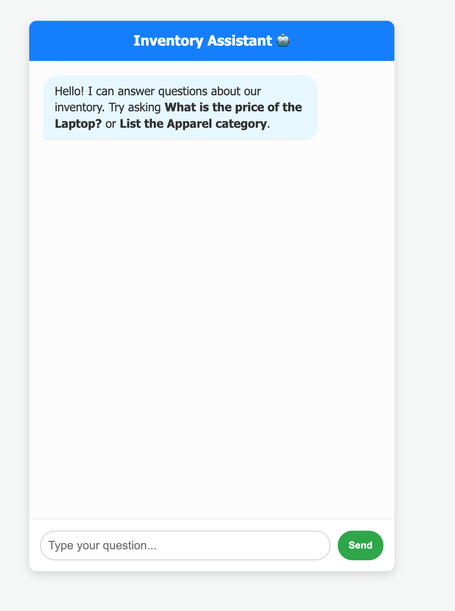

# 🧾 Inventory-Chatbot

## 📌 Description
The Inventory Chatbot is a Flask-based web application that allows users to interact with an inventory dataset using natural language queries.  
It reads data from a CSV file and provides responses based on user input.

## 🚀 Features
- 🔍 Query inventory using simple English  
- 📦 Retrieve item details (price, category, etc.)  
- 📊 Uses CSV file as database  
- ⚡ Fast and lightweight (Flask-based)  
- 🧠 Rule-based NLP logic (no external AI required)  

## 🛠️ Technologies Used
- Python  
- Flask  
- Pandas  
- HTML (Templates)  

## 📁 Project Structure
- inventory Chatbot/
- app.py         
- data.csv
- templates/index.html

## 📸 Screenshot

